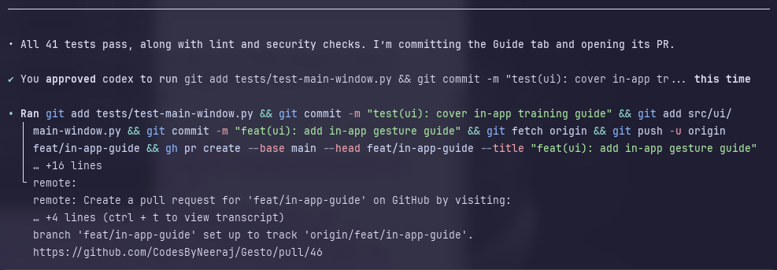

# Gesto

Your gestures, your rules. Gesto is a local macOS app for mapping hand gestures
you train yourself to useful computer actions.

## Download the app

If you want to use Gesto rather than build it from source, go to the
[Releases page](https://github.com/CodesByNeeraj/Gesto/releases), download the
latest `Gesto` zip for your Mac, unzip it, and move `Gesto.app` to
Applications. The current prebuilt release supports Apple Silicon Macs.

The release is an unsigned beta. On the first attempt to open Gesto, macOS will
show a warning that Apple cannot verify it. Dismiss the warning, then open
**System Settings > Privacy & Security**, scroll to **Security**, click **Open
Anyway** beside the Gesto message, and confirm **Open**.

### Keep detection running

After selecting **Start Detection**, leave Gesto open for gesture controls to
work. You can minimise the window or leave it open while you continue working,
but do not close the app. When you want to stop using gestures, select **Stop
Detection** and close Gesto, or simply close the app; closing it stops
detection.

## Setup on macOS

Gesto requires **Python 3.12** to run from source or build the app. It is not
tested with older or newer Python versions. Check whether it is available:

```bash
python3.12 --version
```

If the command is unavailable, install Python 3.12 from
[python.org](https://www.python.org/downloads/) or with Homebrew:

```bash
brew install python@3.12
```

Gesto's media, tab-navigation, and lock-screen actions use Apple's `swift`
command. This one-time command installs Swift as part of Xcode Command Line
Tools:

```bash
xcode-select --install
```

Follow the macOS installer prompt until it completes. Then run:

```bash
/usr/bin/swift --version
```

If it prints a Swift version, continue. If it does not, the Apple installer has
not finished or needs to be run again.

Then build the app bundle:

```bash
git clone https://github.com/CodesByNeeraj/Gesto.git
cd Gesto
python3.12 -m venv .venv
source .venv/bin/activate
python -m pip install -r requirements.txt
scripts/build-macos-app.sh
open dist/Gesto.app
```

### Set permissions before use

Open **System Settings > Privacy & Security** and give Gesto these permissions
before relying on its actions:

- **Accessibility**: required for media play or pause, browser tab switching,
  and locking the screen. Open **System Settings > Privacy & Security >
  Accessibility**, click **+**, authenticate, select `Gesto.app` from
  Applications, then turn on its toggle. If macOS lists Swift separately,
  enable it too.
- **Screen Recording**: enable Gesto if you plan to use the take-screenshot
  action.
- **Camera**: launch Gesto and click **Start Detection** once. macOS will then
  show the Camera prompt. Choose **Allow**. If you denied it, enable Gesto
  under **Camera** in System Settings.

## Who it is for

For anyone who wants a personalised shortcut layer without memorising more key
combinations.

## What it solves

Opening an app, pausing/playing media, switching tabs, or taking a screenshot
is quick once. Repeating those interruptions breaks focus. Gesto lets you
define a gesture that feels natural to you, map it to one action, and trigger
it from your laptop camera.

## Features

- Train named static gestures from 40 hand-landmark samples.
- Retrain or remove a gesture without rebuilding the rest of your mappings.
- Map one gesture to open an app, play or pause media, take a screenshot, lock
  the screen, or switch to the next or previous browser tab.
- Pick an installed app or type its name when creating an open-app mapping.
- Use confidence thresholds and a cooldown to reduce accidental triggers.
- Keep camera frames, landmarks, trained models, and mappings on your Mac.

## How it works

MediaPipe extracts 21 hand landmarks from each camera frame. Gesto stores the
samples for gestures you train locally and uses a scikit-learn KNN classifier to
recognise them. A background detection loop looks up the matched gesture in a
local JSON mapping file and executes its assigned macOS action.

## Tech stack

### Core application

- **Python 3.12**: application runtime.
- **CustomTkinter**: native macOS desktop interface.
- **OpenCV**: camera access and frame capture.
- **MediaPipe**: 21-point hand-landmark extraction.
- **scikit-learn**: local KNN gesture matching.

### Distribution

- **PyInstaller**: packages the application as `Gesto.app`.

### Development and verification

- **pytest**: automated unit tests.
- **Flake8**: Python style and lint checks.
- **Bandit**: static security analysis.
- **GitHub Actions**: runs the project checks on pushes and pull requests.

## Architecture Diagram

```text
USER SETUP: TRAIN A GESTURE, THEN MAP IT

                 ╭────────────────╮
                 │ Start training │
                 ╰───────┬────────╯
                         ▼
       ╱ User names a gesture and selects Train / Retrain ╲
                         │
                         ▼
┌────────────────────────────────────────────────────────────┐
│ Process: TrainingSession opens the camera. OpenCV reads a   │
│ frame every 0.1 seconds. MediaPipe extracts 21 landmarks.   │
└───────────────────────────┬────────────────────────────────┘
                            ▼
                   ◇ Hand detected? ◇
                     │ Yes       │ No → read next frame
                     ▼           └───────────────────┐
┌──────────────────────────────────────────────────┐ │
│ Process: Add the 21-landmark sample to the        │◄┘
│ training set.                                     │
└───────────────────────────┬──────────────────────┘
                            ▼
              ◇ 40 valid samples collected? ◇
                    │ No              │ Yes
                    └─── read next ───┤
                                      ▼
┌────────────────────────────────────────────────────────────┐
│ Process: CustomTrainer normalizes the 40 samples into        │
│ 63-number vectors, trains KNN, and saves the model, centroid,│
│ and boundary at ~/.gesto/models/<gesture>.joblib.            │
└───────────────────────────┬────────────────────────────────┘
                            ▼
       ╱ User selects the gesture, chooses its action, and saves it ╲
                            │
                            ▼
┌────────────────────────────────────────────────────────────┐
│ Process: MappingController saves the mapping and settings in│
│ ~/.gesto/config.json.                                       │
└───────────────────────────┬────────────────────────────────┘
                            ▼
                ╭─────────────────────────╮
                │ Gesture ready to use    │
                ╰─────────────────────────╯

USER USE: DETECT A GESTURE AND RUN ITS ACTION

                 ╭─────────────────╮
                 │ Start detection │
                 ╰────────┬────────╯
                          ▼
       ╱ User presents a trained gesture to the camera ╲
                          │
                          ▼
┌────────────────────────────────────────────────────────────┐
│ Process: DetectionLoop runs in a background thread. OpenCV  │
│ reads a live frame; MediaPipe extracts 21 landmarks.         │
└───────────────────────────┬────────────────────────────────┘
                            ▼
                   ◇ Hand detected? ◇
                     │ Yes       │ No → read next frame
                     ▼           └───────────────────┐
┌────────────────────────────────────────────────────────────┐
│ Process: Normalize live landmarks into the same 63-number   │◄┘
│ vector used during training.                                 │
└───────────────────────────┬────────────────────────────────┘
                            ▼
┌────────────────────────────────────────────────────────────┐
│ Process: For every saved model, KNN finds its one nearest    │
│ training vector (n_neighbors=1). Reject outside-boundary     │
│ matches and keep the accepted gesture with best score.       │
└───────────────────────────┬────────────────────────────────┘
                            ▼
                ◇ Best score at least 70%? ◇
                  │ Yes              │ No → read next frame
                  ▼                  └─────────────────────────┐
           ◇ Outside one-second cooldown? ◇                    │
                  │ Yes              │ No → read next frame    │
                  ▼                  └───────────────────┐     │
┌────────────────────────────────────────────────────────────┐│
│ Process: ActionMapper looks up the gesture in config.json.  │◄┘
└───────────────────────────┬────────────────────────────────┘
                            ▼
                    ◇ Mapping exists? ◇
                     │ Yes       │ No → read next frame
                     ▼           └─────────────────────────────┐
┌────────────────────────────────────────────────────────────┐
│ Process: ActionExecutor runs the mapped macOS action: open   │◄┘
│ app, play/pause media, switch tabs, screenshot, or lock.    │
└───────────────────────────┬────────────────────────────────┘
                            ▼
                 ╭─────────────────────╮
                 │ Continue detection  │
                 ╰─────────────────────╯
```

## Privacy

Camera frames, landmarks, and trained models stay on your Mac. Gesto neither
collects nor uploads them to backend servers. Detection runs only after you
start it.

## OpenAI Build Week Hackathon

Built for the **OpenAI Build Week Hackathon** in **Apps for Your Life**:
consumer apps for everyday life, across productivity, creativity, home, family,
travel, health, and personal finance.

## Building with Codex

Gesto was developed through an ongoing collaboration between the project owner (me!)
and Codex, powered by GPT-5.6-terra. The project owner set the product direction and
made the key calls on the gesture-first workflow, custom training, local-only
privacy, supported actions, and UI behaviour. Codex accelerated delivery by
turning those decisions into small, tested pull requests, investigating runtime
bugs, improving macOS packaging, and maintaining the test, lint, and security
checks. GPT-5.6 and Codex helped move quickly from product requirements to a
working local desktop application, while the final product and design decisions
remained human-led.

## Codex Usage

### Example of Codex in action



### Project thread

The core functionality was built in the following Codex project thread:

```text
Codex Session ID: 019f70e4-4789-7070-916b-cc7bc7e1fea3
```
